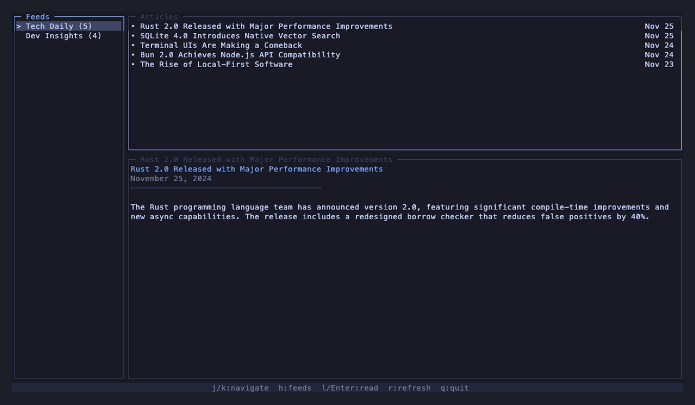

# Tread

A fast, keyboard-driven TUI RSS reader built with [OpenTUI](https://github.com/sst/opentui).



## Features

- **3-pane interface**: Feeds, articles, and article content view
- **Vim-style keybindings**: Navigate efficiently with `j`, `k`, `h`, `l`, `gg`, `G`
- **Read tracking**: Articles are marked as read and persisted in a local SQLite database
- **Fast**: Built with Bun for quick startup and feed fetching
- **Simple configuration**: TOML-based feed configuration

## Installation

### Homebrew (macOS/Linux)

```bash
brew install quietworks/tread/tread
```

### From Source

Requires [Bun](https://bun.sh) v1.0 or later.

```bash
git clone https://github.com/quietworks/tread.git
cd tread
bun install
bun run start
```

## Quick Start

```bash
# Create a sample configuration
tread --init

# Start reading
tread
```

## Configuration

Configuration is stored at `~/.config/tread/config.toml` (or `$XDG_CONFIG_HOME/tread/config.toml`).

Run `tread --init` to create a sample config, or create one manually:

```toml
[[feeds]]
name = "Hacker News"
url = "https://hnrss.org/frontpage"

[[feeds]]
name = "Lobsters"
url = "https://lobste.rs/rss"

[[feeds]]
name = "The Pragmatic Engineer"
url = "https://newsletter.pragmaticengineer.com/feed"

# Theme configuration (optional)
[theme]
name = "tokyo-night"  # Options: tokyo-night, dracula, nord, gruvbox

# Or override individual colors:
# [theme.colors]
# primary = "#ff79c6"
# accent = "#8be9fd"
```

## Keybindings

### Navigation

| Key | Action |
|-----|--------|
| `j` / `Down` | Move down / scroll down |
| `k` / `Up` | Move up / scroll up |
| `h` / `Left` | Go to previous pane / go back |
| `l` / `Right` | Go to next pane / select |
| `Enter` | Select item |
| `gg` | Jump to top |
| `G` | Jump to bottom |
| `Tab` | Cycle between panes |

### Actions

| Key | Action |
|-----|--------|
| `r` | Refresh current feed |
| `R` | Refresh all feeds |
| `o` | Open article in browser |
| `:` | Open command palette |
| `q` | Quit / go back |
| `Ctrl+C` | Quit |

### Article View

| Key | Action |
|-----|--------|
| `j` / `k` | Scroll content |
| `Ctrl+D` / `Space` | Page down |
| `Ctrl+U` | Page up |

## Data Storage

Tread respects XDG Base Directory specifications:

- **Configuration**: `$XDG_CONFIG_HOME/tread/config.toml` (default: `~/.config/tread/config.toml`)
- **Database**: `$XDG_DATA_HOME/tread/tread.db` (default: `~/.local/share/tread/tread.db`)

## Debugging

Tread supports configurable logging for troubleshooting:

```bash
# Set log level (debug, info, warn, error, none)
TREAD_LOG_LEVEL=debug tread

# Write logs to a file instead of stderr
TREAD_LOG_FILE=/tmp/tread.log TREAD_LOG_LEVEL=debug tread
```

Log levels:
- `debug`: Detailed information for debugging (includes key events, input handling)
- `info`: General informational messages
- `warn`: Warning messages
- `error`: Error messages only
- `none`: No logging (default)

## License

MIT License - see [LICENSE](LICENSE) for details.
